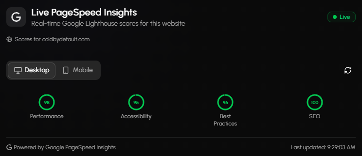

<div align="center">

# ColdByDefault Portfolio · V6.1.2
---

Modern, secure, high‑performance developer portfolio built with Next.js 16, TypeScript, a strongly hardened edge-first architecture & multi‑locale SEO‑optimized delivery.




**Live:** https://www.coldbydefault.com 
**Docs:** https://docs.coldbydefault.com/ 
**Stack:**
Next.js 16.2 · React 19.2.3 · TypeScript 5.x · Tailwind 4.1.12 · shadcn/ui 
Embla Carousel · Framer Motion 12.x · next-intl 4.11 · Prisma ORM 7.8 
Neon PostgreSQL · Zod 4.x · Vercel AI SDK 7 · ESLint 9.x · Playwright + axe-core · Vercel

</div>

---

## Table of Contents

1. Overview
2. Recent Releases
3. Technology Stack
4. Key Features
5. AI Integrations
6. Live Tools
7. Internationalization (i18n)
8. SEO & Discoverability
9. Performance & Accessibility
10. Architecture Overview
11. API Surface
12. Security & Hardening
13. GitHub Actions & Automation
14. Privacy & Data Handling
15. Development (Local Setup)
16. License & Intellectual Property
17. Contact
18. Special Thanks

---

## 1. Overview

This portfolio serves as a professional showcase of engineering capability: performant UI, secure API integrations (GitHub, PageSpeed), accessibility‑focused design, production‑grade hardening, and multi‑language + deep structured SEO implementation.

Beyond the portfolio surface, the project now hosts a small suite of **interactive live tools** (ROI calculator, email rewriter, automation audit) and a service/package offering — each backed by validated, rate‑limited API routes. All code is proprietary and published strictly for viewing.

---

## 2. Recent Releases

Condensed summary of what shipped since the previous README revision (v6.0.8).

**v6.1.1 — Navigation & motion polish**

**v6.1.0 — Unified visual system**

@latest release — v6.0.13 — SEIJAKU | **Privacy, compliance & maintenance**

**v6.0.9 – v6.0.12 — Live tools, a11y testing & error handling**

---

## 3. Technology Stack

Core:

* Next.js 16.2 (App Router, Server Components, Turbopack dev, Edge runtime where applicable)
* React 19.2.3, TypeScript 5.x (strict mode)
* Tailwind CSS 4.1.12 + PostCSS
* shadcn/ui (Radix accessible primitives)
* Embla Carousel 8.6.0
* Framer Motion 12.23.12 (lazy‑loaded motion features)
* next-intl 4.11 (server aware, cookie‑driven locale)
* Zod 4.x (runtime schema validation)
* Prisma ORM 7.8 + Neon serverless PostgreSQL
* Vercel AI SDK 7 (`ai` 7.0.47, `@ai-sdk/openai` 4.0.27, `@ai-sdk/react` 4.0.50) — streaming chatbot transport
* Vercel Hosting & Edge Network

Development & Quality:

* ESLint 9.x (flat config, TypeScript-ESLint 8.41 integration)
* Playwright 1.59 for end‑to‑end tests, `@axe-core/playwright` for automated accessibility assertions
* Strict type checking with zero `any` tolerance
* Comprehensive type coverage for all API interfaces (`AuditResult`, `GitHubData`, `ChatBotConfig`, service/use‑case models)
* Discriminated unions for locale handling and error states
* Inlang project configuration (`project.inlang/`) for message tooling

---

## 4. Key Features

User Experience & UI:

* Responsive, mobile‑first adaptive layout
* Theme switching (light/dark) with persistence
* Section rail navigation with localized labels and inline CTAs
* Scroll‑reveal animation system and a unified card design language
* Animated hero, project & certification showcases; `ScrambleText` headings
* Carousel showcases with autoplay
* Cookie consent banner with localized content (EN / DE / ES / SV / FR)
* Accessibility: ARIA support, keyboard navigation, `aria-hidden` on decorative icons, Radix primitives
* Globally localized error boundaries

Content & Data:

* Dynamic project, technology, service package and certification data modules
* Real‑time GitHub repository & profile fetch (sanitized & cached)
* Google PageSpeed Insights integration for performance transparency
* Blog system with dynamic content management, filtering and per‑slug routes
* CRUD admin dashboard for blog management and chatbot log review
* Service packages and use‑case showcases with structured, translatable data

---

## 5. AI Integrations

Three AI‑backed surfaces, each isolated behind its own validated, rate‑limited API route:

| Surface              | Route                        | Provider                   | Notes                                                     |
| --- | --- | --- | --- |
| Chatbot ("Reem")     | `/api/chatbot`               | Vercel AI SDK 7 → `@ai-sdk/openai` (Responses API) | Streamed replies, client‑held history, spam/prompt sanitation, consent‑gated logging |
| Automation Audit     | `/api/automation-audit`      | OpenAI Chat Completions    | Structured JSON audit result, dedicated rate limiter      |
| Polite Email Rewriter| `/api/email-rewrite/*`       | Groq (`openai/gpt-oss-120b`) | Analyze / rewrite / remaining‑quota endpoints            |

Shared controls across all AI routes:

* Zod request validation with length caps and spam heuristics
* Per‑IP windowed rate limiting (minute + hour windows) with `Retry-After` on quota exhaustion
* Model IDs and API keys supplied exclusively via environment variables — never hard‑coded
* Provider errors normalized into standardized error envelopes; no upstream detail leakage
* Feature flags (`CHATBOT_ENABLED`) allowing runtime disablement
* Chat requests set `store: false`, opting out of OpenAI‑side response retention

Chatbot specifics since the AI SDK migration:

* `streamText` on the server, `useChat` + `DefaultChatTransport` on the client; replies stream as SSE with a stop control
* Conversation history is owned by the browser and replayed with each message, so context no longer depends on which serverless instance answers. It is validated server‑side with `validateUIMessages`, capped by message count, and any client‑supplied `system` turn is rejected
* Failures cross the wire as bare codes (`RATE_LIMIT_EXCEEDED`, `QUOTA_EXCEEDED`, …) that the client maps onto translated strings — no provider text ever reaches the UI
* Consent‑gated persistence runs in the stream's `onFinish`, skipped when the visitor aborts

> **Not yet migrated:** `/api/automation-audit` and `/api/email-rewrite/*` still call their providers through hand‑rolled `fetch` wrappers with bespoke response‑shape parsing.

---

## 6. Live Tools

Self‑contained interactive tools that demonstrate applied automation and AI work:

| Tool                | Route                | Description                                                                 |
| --- | --- | --- |
| ROI Calculator      | `/rio-calculator`    | Client‑side calculator estimating automation return on investment           |
| Polite Email        | `/polite-email`      | Tone analysis and rewriting with selectable modes, quota‑limited per visitor |
| Automation Audit    | `/automation-audit`  | Guided multi‑step questionnaire producing a scored audit + recommendations   |

Each tool ships with typed data/config modules under `data/live-tools/`, dedicated types under `types/live-tools/`, and Playwright coverage in `tests/e2e/live-tools.spec.ts`.

---

## 7. Internationalization (i18n)

Runtime locale negotiation with graceful fallbacks — cookie‑driven rather than path‑prefixed:

* Framework: `next-intl` (server aware, streaming compatible)
* Supported locales: `en`, `de`, `es`, `fr`, `sv`
* Detection: `Accept-Language` parsed in `proxy.ts`, persisted to a long‑lived `PORTFOLIOVERSIONLATEST_LOCALE` cookie
* Fallback: `de` when no `Accept-Language` header is present (privacy‑mode browsers); client‑side `LocaleAutoDetect` corrects using `navigator.language`
* Cross‑tab synchronization of the selected locale
* Legacy path‑prefixed locale routes (`/de/...` and other two‑letter prefixes) are 301‑redirected to the unprefixed equivalents
* Message Bundles: JSON under `messages/`, with Inlang project configuration for tooling

---

## 8. SEO & Discoverability

Advanced multi‑locale SEO system delivering consistent structured metadata:

* Config‑driven locale specific SEO objects
* Open Graph & Twitter card variants per locale (images, titles, descriptions)
* JSON-LD generation for Person + BreadcrumbList
* Canonical + alternate `hreflang` tags
* Keyword curation & skill taxonomy powering `knowsAbout`
* Dynamic sitemap.xml generation with automatic locale & page discovery
* Dynamic robots.txt with proper crawling directives
* 301 redirect strategy for retired locale‑prefixed URLs
* CSP‑compatible (no unsafe inline script proliferation)
* Verified 100/100 Lighthouse SEO score (Sep 2025) & 100 PageSpeed Insights SEO metric

---

## 9. Performance & Accessibility

Focus Areas:

* First Meaningful Paint minimization via streaming & selective client components
* Dynamic imports for motion providers, backgrounds and other heavy client modules
* Efficient image delivery (static assets + modern formats where suitable)
* Reduced JavaScript footprint (edge/server rendering bias)
* Accessible semantic structure (landmarks, labels, focus states)

---

## 10. Architecture Overview

High‑level structure:

* `app/` — Next.js routing (App Router, route groups: `(legals)`, `(live-tools)`, `(media)`, plus `admin` and `api`)
* `components/` — Domain + UI abstraction layers (hero, github, projects, services, live-tools, nav, visuals, ui primitives)
* `data/` — Structured static metadata (projects, certifications, tech, services, use-cases, live-tool configs)
* `lib/` — Cross‑cutting utilities (security, SEO, rate limiting, chatbot logging, Prisma client)
* `hooks/` — Custom React hooks (language, mobile detection, chatbot, client gating)
* `i18n/` — next-intl request/runtime configuration
* `messages/` — Locale message bundles (en, de, es, fr, sv)
* `prisma/` — Schema, migrations and seed (Blog, BlogCategory, BlogTag, BlogCredit, ChatSession, ChatMessage)
* `tests/e2e/` — Playwright suites (accessibility, locale, public pages, live tools)
* `types/` — Shared type surfaces mirrored per domain
* `mcp-server/` — Auxiliary GitHub MCP server
* `proxy.ts` — Next.js 16 middleware: locale detection, legacy redirects, admin session verification
* `public/` — Static assets (images, logos, icons)

Design Principles:

* Separation of concerns (data vs presentation)
* Minimal surface area for API routes
* Immutable, typed content modules
* Translation keys in data modules, never inline copy

---

## 11. API Surface

Comprehensive API endpoints with security-first design:

| Endpoint                        | Purpose                                            | Notes                                     |
| --- | --- | --- |
| `/api/about`                    | Returns profile / about metadata                   | Static + typed                            |
| `/api/blog`                     | Blog listing and management                        | Prisma + Zod                              |
| `/api/blog/[slug]`              | Single post retrieval + read-count increment       | Optimized increment path                  |
| `/api/github`                   | Fetches GitHub profile + repos (filtered)          | Tokenized (env)                           |
| `/api/speed-insight`            | Surfaces PageSpeed metrics                         | 1h revalidate, `stale-while-revalidate`   |
| `/api/chatbot`                  | Interactive AI chatbot (Reem) for visitor queries  | Vercel AI SDK 7, SSE streamed              |
| `/api/automation-audit`         | Scored automation audit generation                 | OpenAI Chat Completions + audit rate limit |
| `/api/email-rewrite/analyze`    | Tone/intent analysis of a draft email              | Groq                                      |
| `/api/email-rewrite/rewriter`   | Rewrites a draft in the selected mode              | Groq                                      |
| `/api/email-rewrite/remaining`  | Remaining per‑visitor quota                        | Rate-limit introspection                  |
| `/api/admin/blog`               | Administrative blog CRUD                           | HMAC session + rate limited               |
| `/api/admin/chatbot/logs`       | Consent‑gated chat log review                      | HMAC session + rate limited               |

Every route is Zod‑validated and returns standardized error envelopes with no internal leakage; abuse and transport controls are covered in §12.

---

## 12. Security & Hardening

Last internal assessment: 2026‑07 (v6.0.13 maintenance pass) — no known unresolved critical/high issues.

Implemented Layers:

1. **Transport & Headers**: HSTS, CSP, X-Content-Type-Options, X-Frame-Options (deny), Referrer-Policy, Permissions-Policy.
2. **Abuse Mitigation**: per‑IP windowed rate limiting on all AI, admin and live‑tool endpoints; spam heuristics and input sanitation on chat input; session message caps.
3. **Admin Authentication**: HMAC‑SHA256 signed, expiring stateless session cookies verified in `proxy.ts` with `timingSafeEqual`; rate limiting and explicit IP resolution on admin requests.
4. **Dependency Hygiene**: routine `npm audit`, plus explicit `overrides` pinning security‑relevant transitives (postcss, sharp, minimatch, brace-expansion, lodash).
5. **Automated Scanning**: CodeQL static analysis and dependency review run in CI — see §13.

Security Posture Snapshot:

* Critical: 0
* High: 0
* Medium: 0
* Low/Informational: Monitored

---

## 13. GitHub Actions & Automation

**CodeQL Advanced Security Scanning:**

* **Triggers**: Push to main, pull requests, scheduled weekly
* **Languages**: Actions, JavaScript/TypeScript, Python
* **Purpose**: Static analysis for security vulnerabilities, code quality issues, and potential attack vectors
* **Advanced Features**: Multi-language matrix analysis, configurable query packs, integration with GitHub Security tab

**Dependency Review:**

* **Triggers**: Pull requests to main branch
* **Purpose**: Scans dependency changes for known vulnerabilities and license compliance
* **Features**: Blocks PRs with vulnerable dependencies, provides detailed security reports in PR comments

**Version Bump:**

* **Triggers**: Merge to main
* **Purpose**: Automatically increments the package version and commits with `[skip ci]`

**End-to-End & Accessibility Testing:**

* Playwright suites (`npm run test:e2e`) covering public pages, locale behaviour and live tools
* `@axe-core/playwright` assertions catching accessibility regressions on key routes

**Documentation Generation:**

* `npm run docs` runs TypeDoc across components, app, types, hooks, data, i18n, lib, mcp-server, messages and styles, publishing to the documentation site linked at the top of this file.

> **Retired:** the Lighthouse CI workflow and `.lighthouserc.cjs` budgets (v6.0.10), along with the Vercel CRON job that refreshed PageSpeed data every 12 hours. Performance is now tracked through Vercel Speed Insights and `/api/speed-insight`, whose responses are cached at the edge and refreshed on demand.

---

## 14. Privacy & Data Handling

* No invasive tracking; minimal analytical surface (Vercel Analytics & Speed Insights only).
* Cookie consent banner gating non‑essential storage, synchronized across browser tabs.
* **Chat logging is consent‑gated**: with no consent, nothing is persisted — the conversation exists only in the visitor's own browser, and the server keeps nothing once it has answered.
* Chat requests are sent to OpenAI with `store: false`, so replies are not retained on the provider side.
* **No geolocation**: IP‑to‑country/city lookup was removed entirely in v6.0.13; `ipCountry` and `ipCity` are never populated.
* IP addresses are anonymized before storage when anonymization is enabled.
* No third‑party ad or profiling scripts.
* Privacy policy and Impressum maintained under `app/(legals)/` with tracked last‑reviewed dates, localized across all five locales.

---

## 15. Development (Local Setup)

Prerequisites: Node 20+ (LTS recommended), npm, and a PostgreSQL connection string (Neon recommended).

Install & Run:

```bash
npm install          # runs prisma generate via postinstall
cp .env.example .env # then fill in required values
npm run db:push      # sync schema to your database
npm run dev          # Turbopack dev server
```

Useful scripts:

```bash
npm run build        # production build
npm run typecheck    # tsc --noEmit
npm run lint         # eslint .
npm run test:e2e     # Playwright suites (add :ui for interactive mode)
npm run db:seed      # seed blog data
npm run docs         # generate TypeDoc output
```

---

## 16. License & Intellectual Property

Copyright © 2026 ColdByDefault. All rights reserved.

This repository is provided exclusively for viewing professional capability.

Restrictions (Summary):

- No copying, modification, redistribution, or derivative works.
- No commercial or personal reuse of code, assets, or design patterns.
- Use beyond viewing requires explicit prior written permission.

Refer to `LICENSE` file for formal wording.

---

## 17. Contact
Portfolio: https://www.coldbydefault.com

Documentation: https://docs.coldbydefault.com/ 

For professional or security inquiries, reach out via the official channels listed above.
_P.S. If you find any bugs, they're not bugs - they're undocumented features!_

---

## 18. Special Thanks

<div align="center">

A heartfelt thank you to the amazing companies that provide free tiers and support for developers. Your generosity enables independent developers and open-source projects to thrive.

<br />

<a href="https://vercel.com">
  
</a>

**[Vercel](https://vercel.com)** — For providing exceptional hosting, edge network, and deployment infrastructure that powers this portfolio with zero-config deployments and blazing-fast performance.

<br />

<a href="https://neon.tech">
  
</a>

**[Neon](https://neon.tech)** — For offering a serverless PostgreSQL database with generous free tier, enabling scalable and reliable data storage without infrastructure overhead.

</div>

---

> Security research note: Responsible disclosure practices appreciated. Do not attempt exploitation against production infrastructure.
